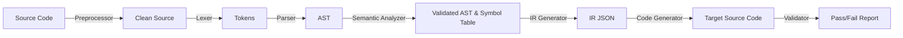

# Source-to-Source Code Compiler (Transpiler)


A sophisticated **Source-to-Source Compiler** (also known as a Transpiler) that translates code between Python, C, and C++. Unlike simple regex-based search-and-replace tools, this transpiler deeply understands the structure and meaning (semantics) of the code. It constructs a language-neutral internal representation (Abstract Syntax Tree) and correctly regenerates idiomatic code in the desired target language.

This project encompasses an end-to-end modern compiler pipeline, fully observable through an interactive Web UI.

## 🚀 Features

*   **Multi-Directional Translation**: Convert seamlessly between Python, C, and C++.
*   **Full Compiler Pipeline**:
    *   **Preprocessor**: Removes comments and formats code.
    *   **Lexical Analyzer (Lexer)**: Custom tokenization with Python INDENT/DEDENT handling.
    *   **Parser**: Hand-written Recursive Descent Parsers.
    *   **Semantic Analyzer**: Two-pass scope checking, type inference, and validation.
    *   **IR Generator**: JSON-serializable Intermediate Representation.
    *   **Code Generator**: Emits robust, syntactically correct target code.
*   **Dynamic Validator**: Automatically executes compiled C/C++ outputs and compares them against Python output to ensure behavioral parity.
*   **Interactive Web UI**: Built with Flask and Vanilla JS. Visualize tokens, browse the AST as a tree diagram, inspect symbol tables, and watch the transpilation step-by-step.

## 🏗️ Architecture

The transpilation follows a standard frontend-backend compiler model:



## 📂 Repository Structure

```text
├── transpiler/
│   ├── ast_nodes.py          # Language-neutral AST models (dataclasses)
│   ├── errors.py             # Unified Error and Phase tracking
│   ├── main.py               # Flask application and pipeline coordinator
│   ├── preprocessor/         # Phase 1: Comment stripping
│   ├── lexer/                # Phase 2: Tokenization (Python, C, C++)
│   ├── parser/               # Phase 3: Recursive descent AST generation
│   ├── semantic/             # Phase 4: Type checking and symbol tables
│   ├── ir/                   # Phase 5: Intermediate Representation (JSON AST)
│   ├── codegen/              # Phase 6: Emitting target code
│   ├── validator/            # Phase 7: Subprocess execution and output diffing
│   ├── visualizer/           # AST Tree visualizer generators
│   └── frontend/             # Single Page App UI (HTML/CSS/JS)
├── testprograms/             # Suite of test code spanning C, C++, and Python
├── PROGRESS.md               # Build phase tracker and line-count metrics
├── requirements.txt          # Python dependencies
└── README.md                 # Project documentation
```

## 🛠️ Tech Stack

*   **Core Compiler Logic**: Pure Python 3.8+ (No external parsing libraries like ANTLR or PLY).
*   **Web Server**: Flask.
*   **Frontend**: Vanilla HTML5, CSS3, JavaScript.
*   **System Dependencies**: `gcc` and `g++` (required for the Validator phase).

## ⚙️ Installation & Setup

### Prerequisites

*   Python 3.8 or newer
*   GCC (for compiling and validating C target code)
*   G++ (for compiling and validating C++ target code)

### Instructions

1.  **Clone the repository:**
    ```bash
    git clone https://github.com/your-username/source-to-source-code-compiler.git
    cd source-to-source-code-compiler
    ```

2.  **Create and activate a virtual environment (optional but recommended):**
    ```bash
    python3 -m venv venv
    source venv/bin/activate  # On Windows: venv\Scripts\activate
    ```

3.  **Install dependencies:**
    ```bash
    pip install -r requirements.txt
    ```

4.  **Run the application:**
    ```bash
    python transpiler/main.py
    ```

5.  **Access the UI:**
    Open your browser and navigate to `http://localhost:5000`

## 🧠 How It Works

### The AST (Abstract Syntax Tree)
At the heart of the compiler is `ast_nodes.py`. Because the parser translates the input language into these standardized nodes (like `IfStmt`, `ForRangeStmt`, `BinaryOp`), the backend code generators do not need to know what the original language was.

### Python Lexical Analysis
Python's semantic whitespace is solved in `python_lexer.py` using an indent stack. When indentation increases, the lexer pushes to the stack and emits an `INDENT` token. When it decreases, it pops from the stack and emits `DEDENT` tokens, allowing the parser to treat indentation identical to `{` and `}` blocks in C.

### Two-Pass Semantic Analysis
The `analyzer.py` runs a two-pass algorithm:
1.  **Pass 1**: Maps global declarations and functions into the symbol table.
2.  **Pass 2**: Walks the AST recursively to enforce type rules, resolve variable references, and validate operator compatibility.

## 🤝 Contributing

We welcome contributions! To maintain a high quality codebase:

1.  **Understand the Architecture**: Read `transpiler/ast_nodes.py` and `transpiler/errors.py` first.
2.  **Ensure Code Quality**: Update `PROGRESS.md` with new line counts.
3.  **Pass All Tests**: Verify that your code changes don't break the validator on the programs in `testprograms/`.
4.  **Open a PR**: Describe your changes in detail.

## 🗺️ Roadmap / Future Scope

*   [ ] Support for Object-Oriented Programming (Classes & Inheritance).
*   [ ] Implementation of `switch/case` statements.
*   [ ] Support for advanced Python data structures (Dictionaries, Sets).
*   [ ] WebAssembly (Wasm) target generator.
*   [ ] Advanced error recovery heuristics in the Parsers.

## 📝 License

This project is licensed under the MIT License. See the [LICENSE](LICENSE) file for details.
